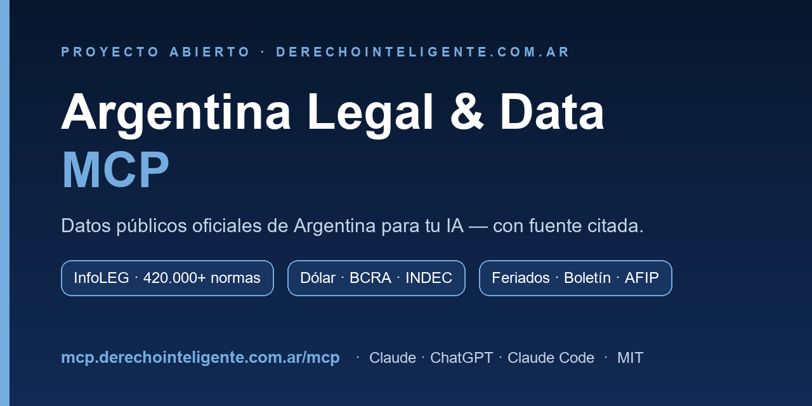

# Argentina Legal & Data MCP



[](LICENSE)


[](https://derechointeligente.com.ar)

> **Un asistente de IA con acceso a los datos públicos oficiales de Argentina.**
> Conectás Claude / ChatGPT a este servidor y te responde con **legislación nacional,
> dólar, BCRA, INDEC, feriados y más** — con **fuente citada** y sin inventar.

**🌐 En vivo:** `https://mcp.derechointeligente.com.ar/mcp`

---

### Un proyecto abierto de [derechointeligente.com.ar](https://derechointeligente.com.ar)

Publicamos **toda la investigación y el código de forma abierta** para **difundir las
posibilidades que nos da la IA generativa** en el mundo jurídico y de datos públicos en
Argentina. La idea es que cualquier persona —abogado, contador, periodista, desarrollador,
tribunal— pueda **usarlo, aprender de él, instalarlo y mejorarlo**. Si te sirve, conectalo;
si querés, contribuí.

> ⚖️ La información proviene de fuentes oficiales y **no constituye asesoramiento jurídico**.
> Es un **insumo** que verifica y cita; la decisión profesional siempre es humana.

---

## ¿Qué es un "MCP"?

El **Model Context Protocol (MCP)** es el estándar que usan los asistentes de IA (Claude,
ChatGPT) para conectarse con fuentes de datos y herramientas externas. Un servidor MCP es,
en criollo, un **"enchufe" 🔌**: lo conectás una vez y después le preguntás a la IA en
lenguaje natural — ella consulta la fuente sola y te responde con datos reales.

**El problema que resuelve:** un modelo de lenguaje solo **alucina** (te inventa el número
de una ley o una fecha) y **está desactualizado**. Este conector lo ancla a **datos
oficiales verificables**.

## Qué puede hacer — 25 herramientas, 4 áreas

| Área | Qué trae |
|------|----------|
| ⚖️ **Legislación nacional (InfoLEG)** | Buscar leyes/decretos/resoluciones, ver **vigencia**, **rastrear modificaciones** (qué la modificó / a qué modificó), **comparar versiones**, texto completo, organismos, tributaria. ~420.000 normas. |
| 💵 **Economía y finanzas** | Dólar (oficial, blue, MEP, CCL, tarjeta), BCRA (reservas, tipo de cambio, tasas, CER), INDEC (IPC y miles de series). |
| 🗓️ **Plazos y calendario** | Feriados nacionales (para cómputo de plazos). |
| 📰 **Otros** | Boletín Oficial (CABA), padrón AFIP por CUIT. |

Recurso: catálogo de tipos de norma · Prompts guiados: `auditar_norma`, `comparar_versiones`,
`buscar_ley_decreto`.

---

## 🧪 Casos de uso prácticos (con prompts listos para copiar)

Estos son ejemplos reales pensados para **abogados, estudios jurídicos y tribunales**. Una
vez conectado, le escribís esto tal cual a Claude/ChatGPT.

### Vigencia y derecho aplicable
- *"¿La **Ley 27.551** de alquileres sigue vigente o fue derogada? ¿Por qué norma y desde cuándo?"*
- *"Para la **Ley 20.744 (LCT)** dame la línea de tiempo de modificaciones de 2020 a hoy; necesito saber qué redacción del art. 245 regía en marzo 2023."*
- *"¿Qué normas **modificó** la **Ley 27.742 (Bases)**, con fechas?"*

### Investigación y encuadre normativo
- *"Buscá normas nacionales sobre **'proteccion de datos personales'** y decime cuáles siguen vigentes y cuál es la ley marco actual."*
- *"Tengo un caso de **despido discriminatorio**: ¿qué leyes y decretos nacionales aplican? Dame las normas con id, fecha y un resumen."*
- *"Resolvé el id de la **Ley 26.994 (CCyC)** y mostrame su ficha: fecha de sanción, B.O., organismo y cuántas normas la modificaron."*

### Texto y comparación de versiones
- *"Traeme el **texto vigente del art. 245 de la LCT** para citarlo en una demanda."*
- *"**Compará** el texto original y el actualizado de la **Ley 24.240** (Consumidor) y decime qué artículos cambiaron."*

### Cómputo de plazos procesales
- *"Me notificaron el **09/06/2026** y tengo **5 días hábiles** para apelar: ¿cuándo vence descontando feriados?"*
- *"Listame los **feriados nacionales de 2026** para planificar vencimientos y audiencias."*

### Actualización de montos (indemnizaciones, cuotas, deudas, sentencias)
- *"Traeme el **IPC del INDEC de los últimos 12 meses** para **actualizar una cuota alimentaria** fijada en enero."*
- *"Actualizá por **CER** $500.000 fijados en marzo 2023 hasta hoy: traeme la serie del BCRA, calculá el coeficiente y aplicámelo."*
- *"Dame el **tipo de cambio mayorista del BCRA del 28/04/2026** para calcular una diferencia de cambio."*

### Control de calidad / verificación (relatores, dictámenes)
- *"Te paso las normas citadas en este proyecto: Ley 26.994, Ley 24.240, Ley 27.551, Decreto 70/2023. Para cada una: confirmá que **existe**, número correcto y si el artículo citado **sigue vigente** o fue sustituido. Marcá en rojo lo inexistente o desactualizado."*

### Datos económicos para escritos y liquidaciones
- *"¿A cuánto está el **dólar** hoy (oficial/blue/MEP)? Convertí una condena de **USD 10.000** al oficial."*
- *"Último valor de **reservas** y de la **tasa de política monetaria** del BCRA."*

> 👉 **40 casos de uso prácticos** (20 para tributaristas + 20 para abogados/relatores),
> con prompts listos: **[`docs/casos-de-uso.md`](docs/casos-de-uso.md)**. Preguntas
> verificables de prueba en [`EVALS.md`](EVALS.md).

---

## 🔌 Cómo conectarlo

**En claude.ai (5 min, sin clave):** Settings → **Connectors** → *Add custom connector* →
Nombre: `Argentina Legal & Data`, URL: `https://mcp.derechointeligente.com.ar/mcp` (sin
credenciales). Activalo en el chat y dale *Permitir* la primera vez.

**En ChatGPT** (Developer mode / Apps): agregá la misma URL como conector.
**En Claude Code:** `claude mcp add --transport http argentina-legal-data https://mcp.derechointeligente.com.ar/mcp`
**Vía API** (Claude `mcp_servers` / OpenAI Responses `tools:[{type:"mcp"}]`): misma URL.

> Es *authless* (datos públicos) → no requiere login. Para uso por-usuario/privado se puede
> activar OAuth o API-key (ver más abajo).

## 🛠️ Cómo está hecho (y a qué se conecta)

- **Python + FastMCP**, transporte `stdio` (local) y `streamable-http` (remoto, el que está
  publicado), detrás de nginx + HTTPS.
- **Híbrido y a prueba de fallos:** un **dataset oficial offline** (SQLite + FTS5, ~420.000
  normas descargadas de `datos.jus.gob.ar`) es la base robusta; las fuentes en vivo agregan
  frescura. Si una fuente falla, **degrada con elegancia y lo avisa**.
- **Fuentes:** InfoLEG (`servicios.infoleg.gob.ar`), dataset `datos.jus.gob.ar`, BCRA
  (`api.bcra.gob.ar`), INDEC/datos.gob.ar (`apis.datos.gob.ar`), DolarAPI, ArgentinaDatos,
  Boletín CABA, AFIP. Todo con **TLS verificado**, caché y backoff.
- **Reimplementación clean-room**, bien testeada (57 tests) — ver [`DECISIONS.md`](DECISIONS.md),
  [`STATUS.md`](STATUS.md), [`NOTICE`](NOTICE).

## 💻 Instalarlo vos mismo (local, con Claude Desktop / Claude Code)

```bash
git clone https://github.com/juanterraf/<este-repo>.git && cd <este-repo>
python -m venv .venv && . .venv/Scripts/activate      # Windows: .venv\Scripts\activate
pip install -e .
python -m arg_legal_mcp build-dataset                 # baja el dataset oficial (~50 MB → SQLite)
python -m arg_legal_mcp                                # corre por stdio
```
Config para Claude Desktop y deploy remoto (Docker / systemd / Caddy): en [`STATUS.md`](STATUS.md)
y los archivos `Dockerfile`, `docker-compose.yml`, `systemd/`, `scripts/deploy-vps.sh`.

## ⚠️ Alcance y límites (honestos)

- Cubre **legislación nacional**; **no** incluye jurisprudencia/fallos, doctrina ni
  normativa provincial.
- El **texto completo** artículo-por-artículo se lee del sitio de InfoLEG; si está caído,
  devuelve la **URL oficial citable** (búsqueda, vigencia, relaciones y cálculos funcionan
  igual offline).
- **AFIP** usa un endpoint no oficial e inestable (la validación del CUIT sí es local y
  confiable); **Boletín** = CABA (el Nacional no tiene API pública estable).
- Es **insumo no vinculante**: verificá contra la fuente oficial antes de cualquier uso
  probatorio.

## 📄 Atribución, datos y licencia

- Proyecto de **[derechointeligente.com.ar](https://derechointeligente.com.ar)**, publicado
  de forma abierta para difundir el uso responsable de la IA generativa.
- Datos: **InfoLEG** (Ministerio de Justicia) y dataset **datos.jus.gob.ar** (CC BY 2.5 AR),
  BCRA, INDEC/datos.gob.ar, entre otros — ver [`NOTICE`](NOTICE) y [`CREDITS.md`](CREDITS.md).
- Código bajo licencia **MIT**. Contribuciones bienvenidas.
